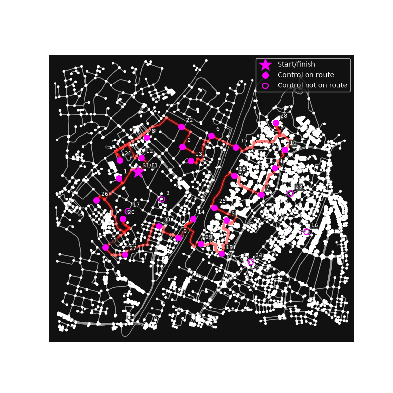

# Optimal Route Planning for OpenStreetMap-based MapRun Score Events

[osm-score.py](osm-score.py) uses the [OSMnx](https://osmnx.readthedocs.io/en/stable/) package to obtain OpenStreetMap data, [NetworkX](https://networkx.org/documentation/stable/index.html) to find the shortest path, and [Google OR-Tools](https://developers.google.com/optimization) to solve "the orienteering problem".

## Running

Dependencies are declared inline in [osm-score.py](osm-score.py) using [PEP 723](https://peps.python.org/pep-0723/) script metadata, with exact versions pinned in `osm-score.py.lock`.
With [uv](https://docs.astral.sh/uv/) installed, run it with no further setup:

```sh
uv run osm-score.py
```

This provisions the interpreter and the locked dependencies automatically.
To refresh the pinned versions, run `uv lock --script osm-score.py`.

## Usage

As input, it expects a `course.kml` file of the format expected by [MapRun](https://maprunners.weebly.com/course-setting---kml-files.html), i.e. with placemarks S1 and F1 representing the start and finish respectively.
It assumes MapRun's ScoreNxx [scoring scheme](https://maprunners.weebly.com/scoring-schemes.html) (change `get_score` if using a different scheme).
Set `max_distance` to the maximum number of metres you want the route to take.
The algorithm is a heuristic, so increasing `search_parameters.time_limit.seconds` may get you better answers.

As output, the programme with list the order of controls to visit, the distance covered, and the score achieved.
It will also show a diagram of the network and selected route, marking the start/finish with a star, the controls on the route with filled circles, and the controls it skips with hollow ones.



## Limitations

The following are known limitations:
* Readability is limited by the use of Copilot to generate the code!
* Routes can only follow the linear network: there's no cutting across open areas!
* A control that isn't on the network is attached to the closest point on the nearest edge, so a control placed some way off a path (a fence corner, say) is routed to as though it were on that path. Where the closest point is an existing junction, the control is attached there instead.
